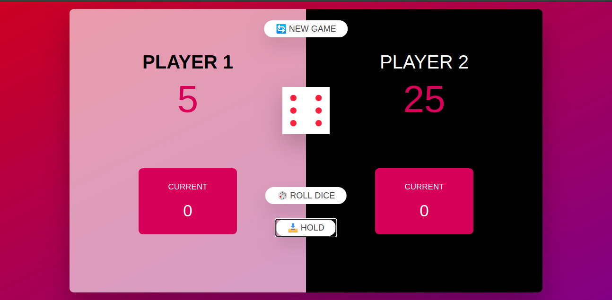

# Simple Pig Game (Game played using DICE)

## Description
This game is built using simple JavaScript DOM Manipulation and basic HTML, CSS.

## Working
This is a game played by 2 players. Every player tries to get score of 20 or above first by rolling the die. The player can keep rolling the die or decide to hold the count he/she has got and add it to the main tally. Once the player decides to hold the count, the turn shifts to the next player, who does the same. The catch is that if any player gets a 1 on the die, he/she losses the entire count, and turn is shifted to next player.

## Credits:
   * Built with the help of udemy course (The Complete JavaScript Course 2020: From Zero to Expert).

