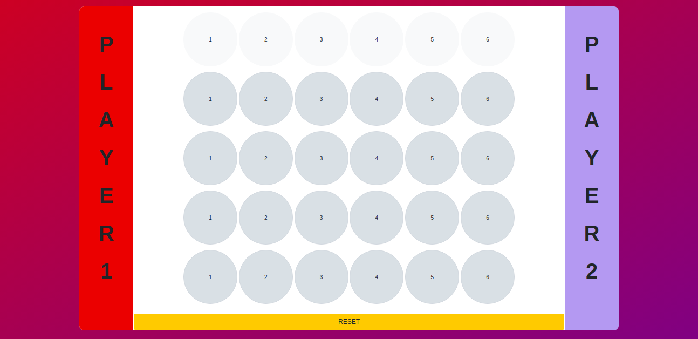
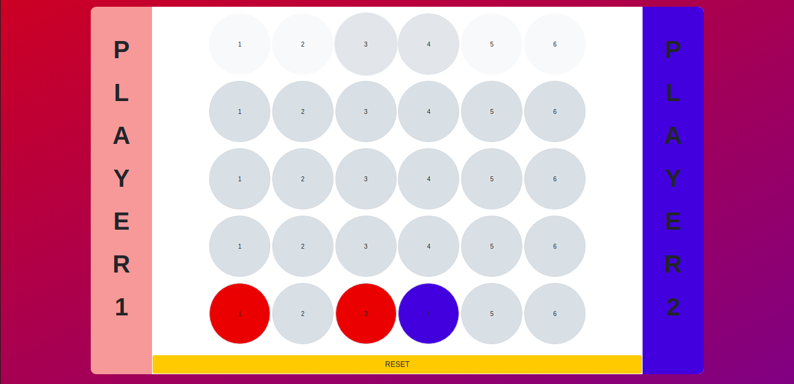
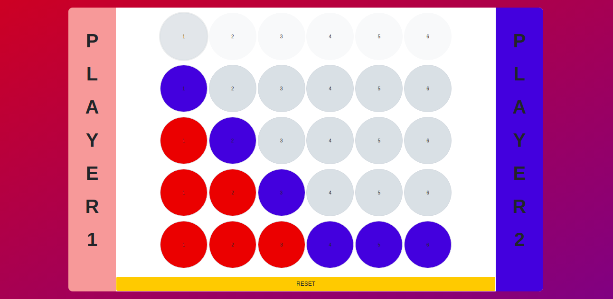

# Connect Four Game (Two player Game)

## Description
This game is built using simple JavaScript DOM Manipulation and basic HTML, CSS.

## Working
This is a game played by 2 players. Every player tries get four dots to match the same color (horizontally, vertically or diagonally). The other player can place his own color in alternating turns to stop the other player. The game continues till dots remain or one player is successful in connecting 4 dots of his color. If no player is successful the game is tied once all dots are colored.

## Credits:
   * Built with the help of udemy course (The Complete JavaScript Course 2020: From Zero to Expert).

