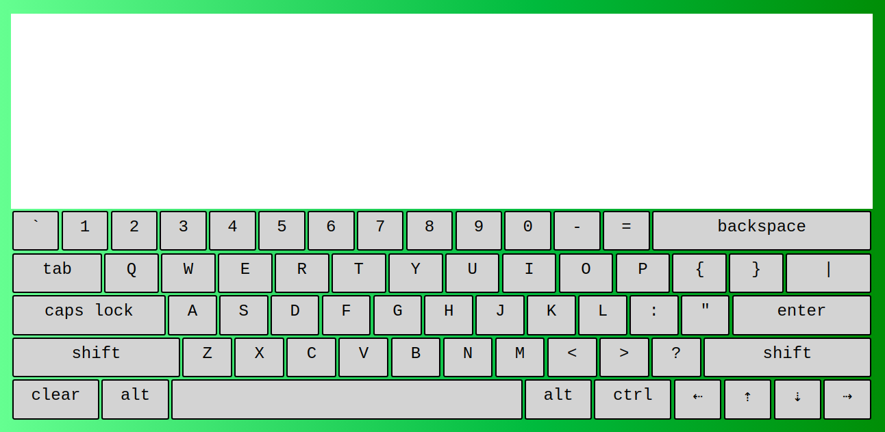
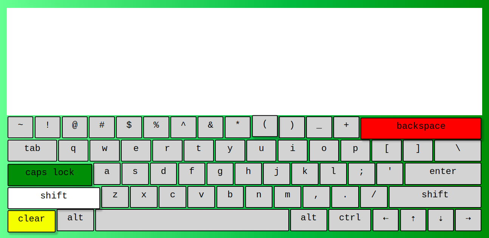
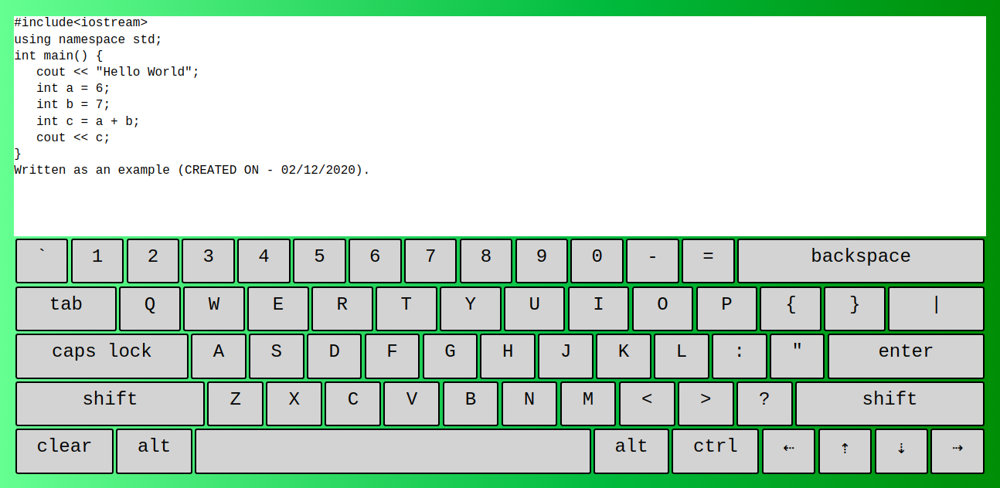

# Virtual Keyboard

## Description
A simple virtual keyboard built using JavaScript DOM Manipulation and basic HTML, CSS.

## Working
A simple virtual keyboard that can be used with regular keypresses as well as with the mousepress.

## Credits:
   * Built with the help of udemy course (The Complete JavaScript Course 2020: From Zero to Expert).

