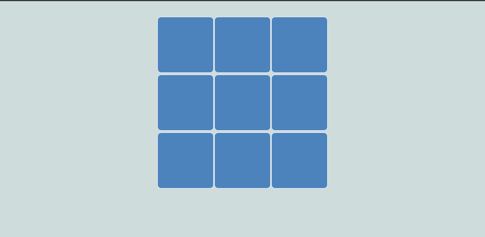
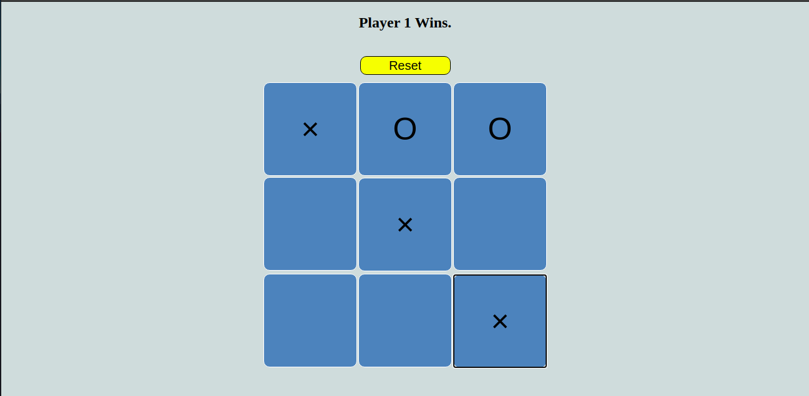

# Tic Tac Toe Game

## Description
This game is built using simple JavaScript DOM Manipulation and basic HTML, CSS.

## Working
X's and O's game first person to create 3 in a row wins.

## Credits:
   * Built with the help of udemy course (The Complete JavaScript Course 2020: From Zero to Expert).

