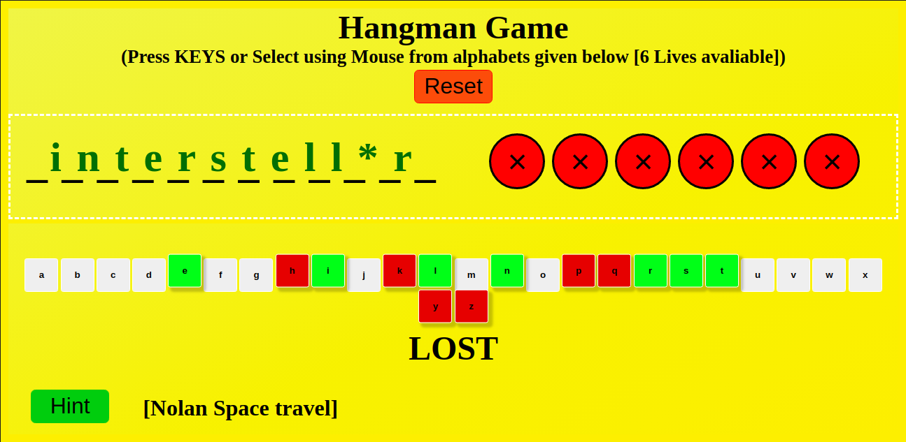

# Hangman Game

## Description
This game is built using simple JavaScript DOM Manipulation and basic HTML, CSS.

## Working
the Computer generates a random word to be guessed by the player. The player has 6 chances i.e. for every wrong guessed letter he/she losses one chance. The letters selected appear at the bottom green indicating correct, red wrong. HINT is also provided incase the player gets stuck.

## Credits:
   * Built with the help of udemy course (The Complete JavaScript Course 2020: From Zero to Expert).

